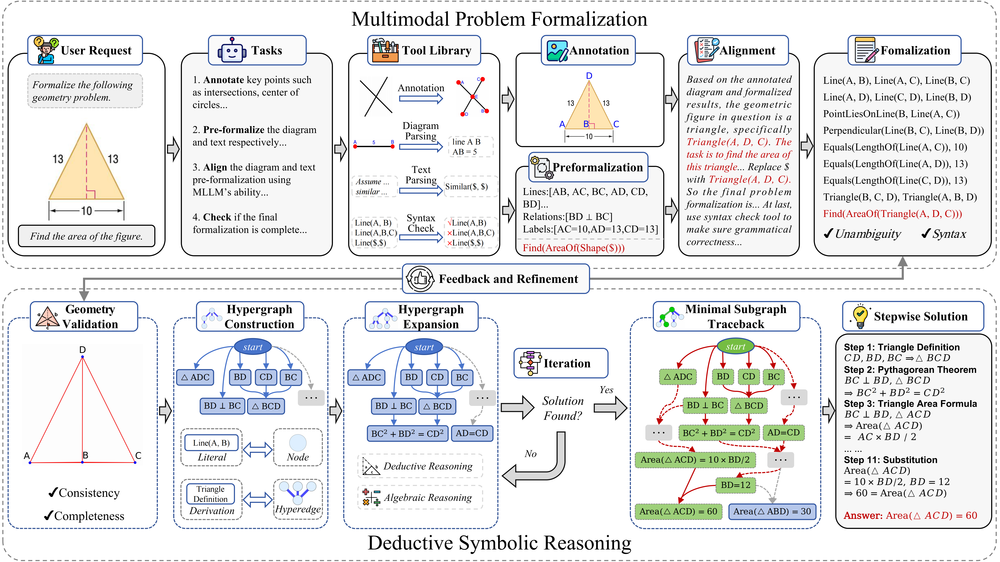
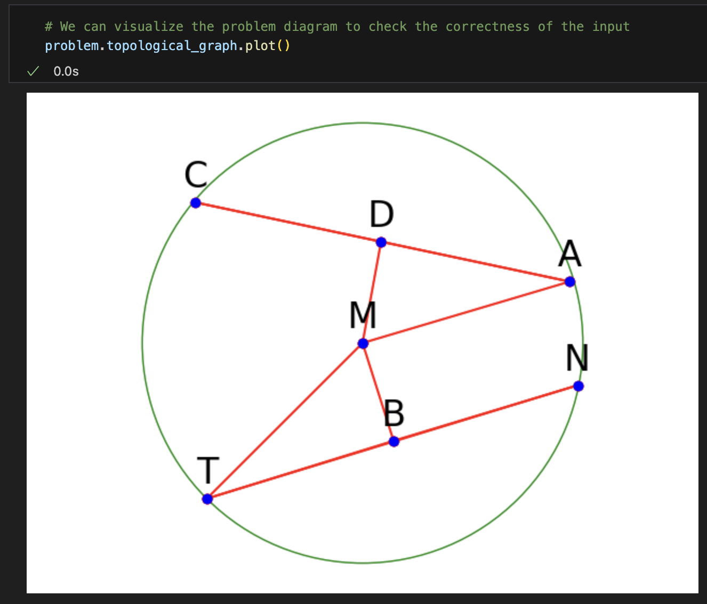
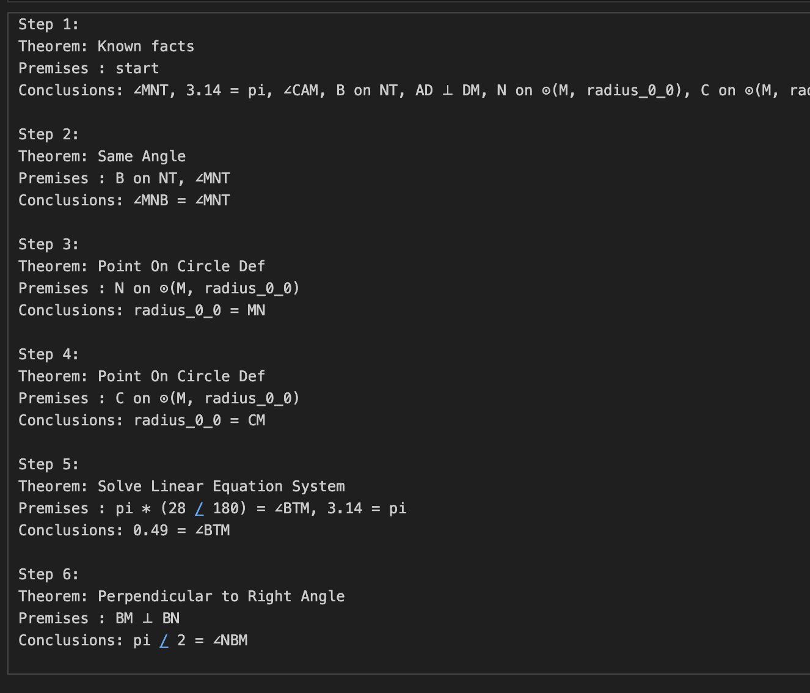

# AutoGPS: Automated Geometry Problem Solving via Multimodal Formalization and Deductive Reasoning




## Folder Structure

```
├── figs/                   # Figures for documentation
├── datasets/           
|   ├── geometry3k          # Geometry3K dataset
|   ├── PGPS9K              # PGPS9K datasets
├── multimodal_formalizer   # Multimodal Problem Formalizer
├── symbolic_reasoner       # Symbolic Decuctive Reasoner
├── scripts                 # Bash scripts
├── README.md               # This file
└── requirements.txt        # Dependencies
```

## Dependencies

Run the following command to initialize a virtural enviroment and install dependencies:
```bash
conda create -n autogps python=3.12 -y
conda activate autogps
pip install -r requirements.txt
```

## Data Preparation

Run the following command to unzip the datasets:

```bash
bash scripts/unzip_data.sh
```


*If you want to prepare the data from scratch, pleass download [**Geometry3K**](https://github.com/lupantech/InterGPS/tree/main) and [**PGPS9K**](https://nlpr.ia.ac.cn/databases/CASIA-PGPS9K/index.html) datasets and place them to corresponding folders, then run the following command*:

```bash
bash scripts/data_preprocess.sh
```

*It generates `images` folder including all problem images well-named for each dataset and gathers all problem information into `{dataset_name}_test.json` file, as previous `unzip_data` command provides.*


## Multimodal Formalization

To formalize the geometry problems,
please provide `model_name`, `base_url` and `api_key` and run the following command.
OpenAI python sdk is used for inference, so that API services both from Internet and localhost are compatible.
The default inference parameters are set as `temperature=0.1, top_p=1, max_tokens=3096` as we provided in the paper.

```bash
cd multimodal_formalizer
export OPENAI_API_BASE="your_openai_base_url"
export OPENAI_API_KEY="your_openai_api_key"
python main.py --model model_name\
    --task alignment\
    --dataset_dir ../datasets/geometry3k
```

If you want to formalize the problems in the PGPK9K dataset, replace `geometry3k` with `PGPS9K`. It takes hours to finish the all the formalization, depending on the inference efficiency. So, we have already provided our formalization results in the `multimodal_formalizer/our_annotations` folder for the next step.


## Symbolic Reasoning

Run the following command to solve problems based on the provided formalzaition file ``geometry3k_gpt4o_alignment.json``:

```bash
cd symbolic_reasoner
python test.py --annotation_file ../multimodal_formalizer/our_annotations/geometry3k_gpt4o_alignment.json\
    --num_processes 30\
    --proof_dir proofs\
    --timeout 1800
```

Running on 30 processes takes about **one hour** on *Intel(R) Xeon(R) Gold 6226R CPU @ 2.90GHz* to finish all problem-solving tasks on Geometry3K.
A new folder named `proofs` including all problem-solving details will be added. After all processes finished, run the following command to evaluate the results:

```bash
python evaluate.py --proof_dir ./proofs
```

If you want to check the results as soon as possible, we have provided our results as well, placed in the `symbolic_reasoner/our_results` folder. For example:

```bash
python evaluate.py --proof_dir our_results/proofs_geometry3k_gpt4o_alignment --show_details
```

Change directory back to the root directoy. Then evaluate for all our results:
```bash
bash scripts/eval_results.sh -d symbolic_reasoner/our_results
```

`-d` stands for `show_details`, which provides detailed *solved list* and *unsolved list*.

## Demo

`symbolic_reasoner/demo.ipynb` is provided for visualization of the proof graph and stepwise solution generation.

<div style="display: flex; justify-content: center; align-items: center; gap: 20px;">
    
    
</div>